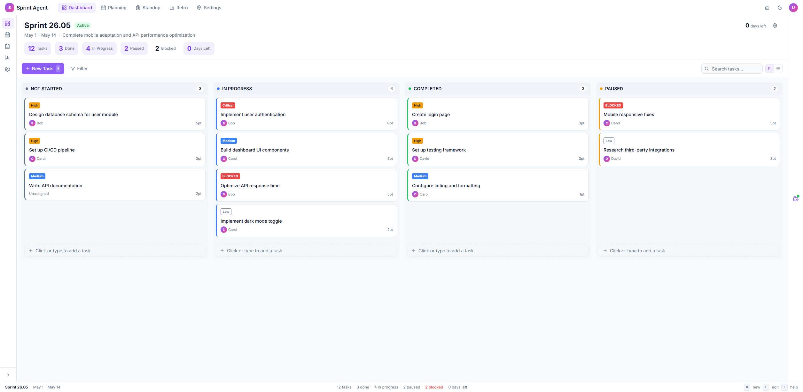
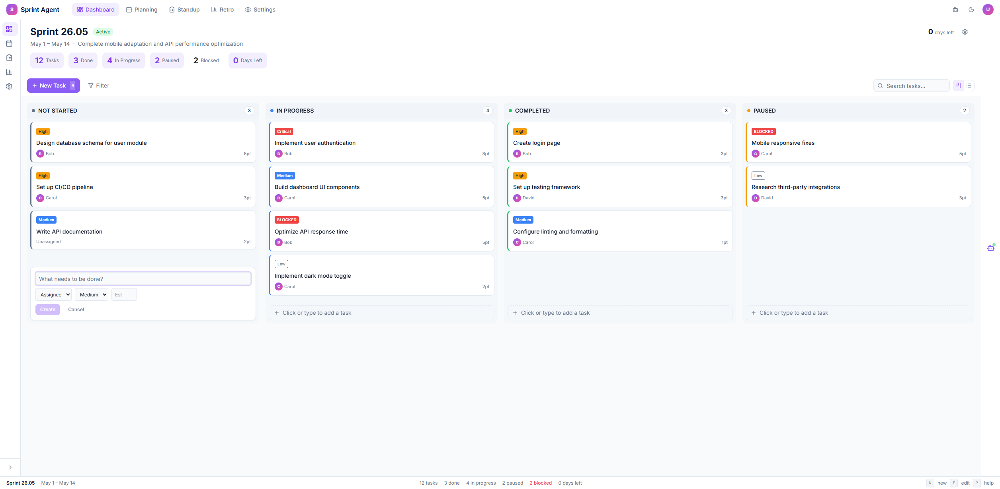
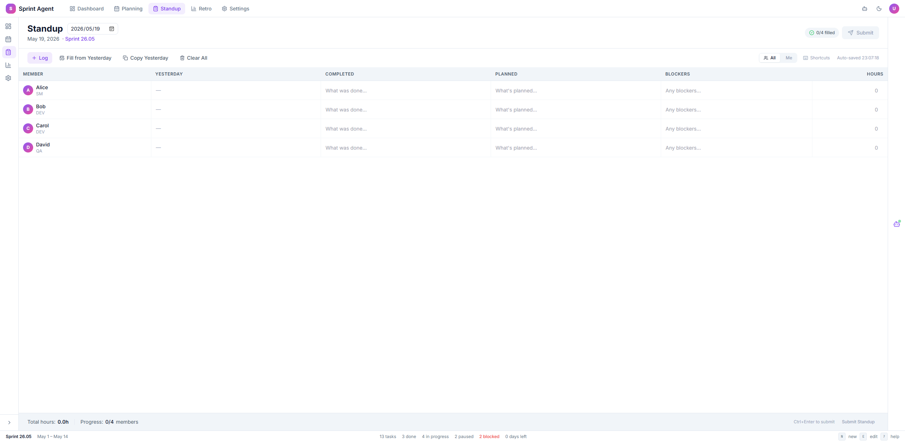
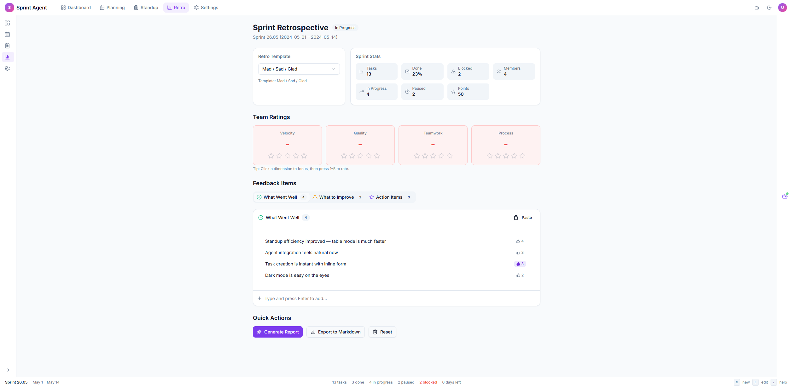
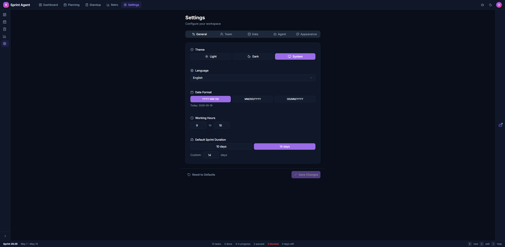

# Sprint Agent

A full-stack Scrum management tool with an AI agent assistant.

- **Frontend**: React 19 + TypeScript + Vite + Tailwind CSS + shadcn/ui
- **Backend**: FastAPI + SQLAlchemy 2.0 + SQLite

## Quick Start

```bash
# Backend
cd backend
pip install -r requirements.txt
uvicorn main:app --reload --port 8000

# Frontend
cd frontend
npm install
npm run dev
```

- Frontend: `http://localhost:3000`
- API Docs: `http://localhost:8000/docs`

### Docker

```bash
docker compose up --build -d
```

## Project Structure

```
sprint-agent/
├── frontend/      # React + TypeScript frontend
├── backend/       # FastAPI backend
├── docs/          # Full documentation
├── scripts/       # Testing & utility scripts
└── screenshots/   # UI screenshots
```

## Documentation

All detailed documentation lives in `docs/`:

| Document | Content |
|----------|---------|
| [`docs/API.md`](docs/API.md) | REST API reference |
| [`docs/ARCHITECTURE.md`](docs/ARCHITECTURE.md) | System architecture |
| [`docs/BACKEND.md`](docs/BACKEND.md) | Backend conventions |
| [`docs/FRONTEND.md`](docs/FRONTEND.md) | Frontend architecture |
| [`docs/DEPLOY.md`](docs/DEPLOY.md) | Deployment guide |
| [`docs/DATA_FORMAT.md`](docs/DATA_FORMAT.md) | `init.json` schema |
| [`docs/USAGE.md`](docs/USAGE.md) | End-user manual |
| [`docs/CHANGELOG.md`](docs/CHANGELOG.md) | Version history |

## Screenshots

| Dashboard | Planning | Standup | Retro | Settings |
|-----------|----------|---------|-------|----------|
|  |  |  |  |  |

## License

MIT
